# CodePulse Architecture

This document details the architecture of CodePulse to facilitate visualization and understanding of the system's components and data flow.

## System Overview

CodePulse is a lightweight monitoring tool designed to track a developer's GitHub activity and send notifications if no activity is detected within a specified timeframe (default: 24 hours). It runs as a scheduled task.

## Components

1.  **Scheduler (Trigger)**
    *   **GitHub Actions**: A workflow (`.github/workflows/daily_check.yml`) configured with a cron schedule (e.g., daily at 09:00 UTC).
    *   **Vercel Cron**: An alternative serverless function (`api/cron.py`) triggered by Vercel's cron job infrastructure.

2.  **Core Logic (`codepulse.py`)**
    *   **Environment Loader**: Loads configuration (Tokens, IDs, URLs) from `.env` or environment variables.
    *   **Activity Checker**: Connects to the GitHub API to fetch the user's public event history.
    *   **Analyzer**: Parses the events to find the latest `PushEvent` and calculates the time elapsed since that push.
    *   **Notifier**: If the time elapsed exceeds the threshold, it triggers notifications via configured channels.

3.  **External Services**
    *   **GitHub API**: Provides the user's activity feed (`/users/{username}/events/public`).
    *   **Telegram API**: Receives HTTP POST requests to send messages to a specific chat via a bot.
    *   **Discord Webhook**: Receives HTTP POST requests to send messages to a Discord channel.

## Data Flow

```mermaid
sequenceDiagram
    participant Scheduler as GitHub Actions / Vercel Cron
    participant Script as CodePulse Script
    participant GitHub as GitHub API
    participant Telegram as Telegram API
    participant Discord as Discord Webhook
    participant User as Developer

    Scheduler->>Script: Trigger Execution (Daily)
    Script->>Script: Load Env Vars (Tokens, IDs)
    Script->>GitHub: GET /users/{username}/events/public
    GitHub-->>Script: JSON Event List
    Script->>Script: Find latest PushEvent
    Script->>Script: Calculate hours_since_push

    alt hours_since_push > 24
        Script->>Telegram: POST /sendMessage (Alert)
        Telegram-->>User: "⚠️ Pulse is flat!"
        Script->>Discord: POST /webhook (Alert)
        Discord-->>User: "⚠️ Pulse is flat!"
    else hours_since_push <= 24
        Script->>Script: Log "Pulse is strong 🚀"
    end
```

## Directory Structure

*   `codepulse.py`: Main standalone script.
*   `api/cron.py`: Vercel serverless function adapter.
*   `.github/workflows/daily_check.yml`: GitHub Actions configuration.
*   `.env`: Local secrets (not committed).
*   `requirements.txt`: Python dependencies.

## Configuration

| Variable | Description |
| :--- | :--- |
| `GITHUB_USERNAME` | Target GitHub user to monitor. |
| `GITHUB_TOKEN` | (Optional) Token for higher API limits or private repo access. |
| `TELEGRAM_BOT_TOKEN` | Token for the Telegram Bot. |
| `TELEGRAM_CHAT_ID` | Target Chat ID for Telegram notifications. |
| `WEBHOOK_URL` | Discord Webhook URL. |
